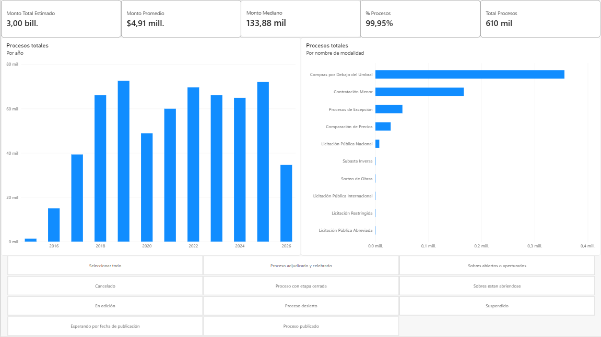

# DGCP Public Procurement Analytics

End-to-end analytics project built from Dominican Republic public procurement open data. The project demonstrates how raw public data can be profiled, cleaned, validated, modeled in SQL Server, and exposed through a Power BI semantic model.

> **Portfolio focus:** Data Analytics · Business Intelligence · Junior Data Engineering

## Project at a glance

| Item | Result |
|---|---|
| Source | DGCP public procurement open data via [datos.gob.do](https://datos.gob.do/) |
| Coverage | 2015-03-27 → 2026-06-30 |
| Raw records | 610,416 |
| Clean records | 610,402 |
| Removed by ETL | 14 rows: 9 negative + 5 extreme monetary values |
| Clean-data retention | 99.9977% |
| Primary stack | Python · pandas · SQL Server · DAX · Power BI |

## Dashboard Preview



## What problem does this solve?

Public procurement data is useful only after its structure and quality are understood. The source used in this project contains mixed currencies, monetary anomalies, categorical flags, and operational fields that are more useful when modeled consistently.

The project turns that source into a repeatable analytical pipeline that can support questions about procurement activity, institutions, modalities, statuses, and source-reported monetary values.

The main objective is **not** to claim causal, compliance, or policy conclusions. It is to build a transparent and reproducible analytics workflow from raw data to reporting.

## What I built

```text
Raw CSV
   ↓
Data profiling / EDA
   ↓
Python ETL + data-quality rules
   ↓
Cleaned dataset
   ↓
SQL Server staging
   ↓
Dimensional model (star schema)
   ↓
Power BI semantic model + DAX
   ↓
Executive dashboard
```

The same cleaning function is shared by the notebook and the production ETL script so that exploratory analysis and the persisted pipeline do not silently use different rules.

## Why it was built this way

### Python / pandas

Python is used for source profiling and ETL because it makes data-quality rules explicit, testable, and reusable. The cleaning logic lives in `src/etl.py` rather than only inside the notebook.

### SQL Server

SQL Server is used as the structured analytical layer between the cleaned file and Power BI. It demonstrates staging, dimension loading, fact loading, referential checks, and reconciliation queries.

### Star schema

The analytical model follows a star-schema pattern because the main business grain is **one row per procurement process** in `Fact_Procurement`, surrounded by descriptive dimensions.

```text
                    Dim_Purchasing_Unit
                             │
                             │
Dim_Process_Status ─── Fact_Procurement ─── Dim_Modality

                     _Measures (Power BI only)
```

This is still a **star schema** after the cleanup work:

- `Fact_Procurement` is the central fact table at process grain.
- `Dim_Purchasing_Unit`, `Dim_Modality`, and `Dim_Process_Status` are descriptive dimensions connected to the fact table.
- `_Measures` is a disconnected Power BI calculation table used only to organize DAX measures; it is not part of the relational star.
- `Staging_Procurement` is an ingestion/staging layer and is not part of the Power BI semantic model.
- Date attributes (`Year`, `Month`, `Quarter`) remain on the fact table intentionally to keep the model compact for this project's scope. A dedicated date dimension would be a reasonable future extension for richer time-intelligence requirements, but it is not required for the current model to be a star schema.

More detail is documented in [`docs/technical_decisions.md`](docs/technical_decisions.md).

## What was solved in the data

The ETL applies documented rules rather than silently changing values:

| Rule | Treatment | Why |
|---|---|---|
| Negative `MONTO_ESTIMADO` | Remove | Invalid for the intended monetary KPI layer |
| Null `MONTO_ESTIMADO` | Remove | Cannot support a monetary fact |
| `MONTO_ESTIMADO >= 100B` | Remove | Extreme source anomaly identified during profiling |
| `MONTO_ESTIMADO = 0` | Retain | Zero is an observed value and should not be confused with missing data |
| Currency | Preserve source currency | No historical FX table is available, so unsupported conversion is avoided |
| Yes/No flags | Standardize to nullable booleans | Makes filtering and downstream modeling consistent |
| Text fields | Strip whitespace without converting nulls to literal `"nan"` | Preserves the distinction between missing and textual values |
| Derived date parts | Create Year / Month / Quarter | Supports straightforward downstream aggregation |

## Evidence from the raw vs. cleaned data

The notebook deliberately uses `describe()` to show why the monetary cleaning rules matter.

| Metric | Raw dataset | Cleaned dataset |
|---|---:|---:|
| Count | 610,416 | 610,402 |
| Mean | RD$2,860,754,063,936,701.50 | RD$4,909,094.93 |
| Std. Dev. | RD$2,235,082,019,392,167,168.00 | RD$203,295,733.67 |
| Min | -RD$1,231,476,600.00 | RD$0.00 |
| Median | RD$133,850.00 | RD$133,869.95 |
| 75th percentile | RD$478,839.18 | RD$478,800.00 |
| Max | 1.74625 × 10²¹ | RD$58,894,249,136.00 |

The key analytical observation is that the **median stays near the same level while the mean is dramatically distorted by extreme observations**. The ETL makes the distribution more useful for descriptive analysis while preserving the underlying cleaning decision in code.

## Reproducible metrics

The analytical metrics are intentionally kept in `notebooks/01_initial_exploration.ipynb`. For this portfolio project, the notebook is the exploratory and analytical layer, so keeping the calculations close to the evidence makes the reasoning easier to follow. The production transformation logic remains in `src/etl.py`, while SQL validation and database loading remain separate.

The notebook reports:

- ETL retention and removal rate.
- Negative, null, extreme, and retained-zero counts.
- Duplicate and null process-code checks.
- Raw vs. cleaned `describe()` statistics.
- Currency-level record count, total, average, and median.
- DOP-only total, average, median, and mean/median ratio.
- Distinct purchasing units, modalities, and statuses.
- MiPyMEs, MiPyMEs-women, green-purchase, and joint-purchase record shares.
- Top-3 modality concentration by process count.

For the full cleaned dataset:

| Metric | Value |
|---|---:|
| DOP process count | 610,090 |
| DOP record share | 99.95% |
| Total DOP estimated amount | RD$2,995,095,263,307.73 |
| Average DOP estimated amount | RD$4,909,267.92 |
| Median DOP estimated amount | RD$133,877.04 |
| DOP mean / median ratio | 36.67× |
| Purchasing units | 731 |
| Modalities | 10 |
| Process statuses | 10 |
| Processes marked for MiPyMEs | 58,522 (9.59%) |
| Processes marked for MiPyMEs women | 10,114 (1.66%) |
| Green-purchase flag | 3,083 (0.51%) |
| Joint-purchase flag | 102 (0.02%) |
| Top 3 modalities share | 93.93% |

### Currency handling

The project **does not perform FX conversion**. The source contains `DOP`, `USD`, `EUR`, `GBP`, `COP`, and `MXN`. Amounts remain in their source currencies for segmented analysis.

Executive financial KPIs are restricted to `DOP` records:

```text
DOP records:              610,090
DOP share of clean rows:      99.95%
Total DOP amount:        RD$2.995T
Average DOP amount:        RD$4.91M
Median DOP amount:       RD$133.88K
```

This is a **source-currency slice, not an FX-converted total**.

> `DIRIGIDO_MIPYMES` means that a process is marked as directed to MiPyMEs. It should not be described as proof that a process was ultimately awarded to a MiPyME.

## SQL data model

The SQL layer separates ingestion from analytical modeling:

```text
Staging_Procurement
        │
        ├── Dim_Purchasing_Unit ──┐
        ├── Dim_Modality ─────────┼── Fact_Procurement
        └── Dim_Process_Status ───┘
```

The SQL scripts are intentionally ordered so another reviewer can follow the data path:

```text
01_create_database.sql
02_create_tables.sql
03_load_star_schema.sql
04_data_quality_checks.sql
```

`03_load_star_schema.sql` repopulates the dimensions and fact table from staging. The Python loader truncates staging by default before reloading it, making repeated staging loads deterministic.

## Power BI

Open [`reports/dgcp_procurement_dashboard.pbix`](reports/dgcp_procurement_dashboard.pbix).

The current Power BI semantic model contains:

- `Fact_Procurement`
- `Dim_Purchasing_Unit`
- `Dim_Modality`
- `Dim_Process_Status`
- `_Measures`

The report uses DAX measures such as process count, estimated amount, average amount, and MiPyMe-related process share. The documented DOP-only reconciliation measures are in [`reports/DAX_MEASURES.md`](reports/DAX_MEASURES.md).

## Business questions supported

The project can support descriptive questions such as:

- How many procurement processes are represented in the cleaned data?
- What is the estimated procurement amount for DOP-denominated processes?
- How does process volume evolve by year?
- Which purchasing units account for the most process records?
- Which modalities dominate process volume?
- What share of processes is marked for MiPyMEs?
- How are processes distributed across statuses and currencies?

These are descriptive analytics questions; the project does not infer causality or compliance outcomes from the source fields.

## Project structure

```text
dgcp-public-procurement-analysis/
├── data/
│   ├── sample/
│   │   └── dgcp_secp_sample_1000.csv
│   └── README.md
├── docs/
│   └── technical_decisions.md
├── notebooks/
│   └── 01_initial_exploration.ipynb
├── reports/
│   ├── dgcp_procurement_dashboard.pbix
│   ├── DAX_MEASURES.md
│   └── README.md
├── sql/
│   ├── 01_create_database.sql
│   ├── 02_create_tables.sql
│   ├── 03_load_star_schema.sql
│   └── 04_data_quality_checks.sql
├── src/
│   ├── __init__.py
│   ├── etl.py
│   └── load_to_db.py
├── tests/
│   ├── conftest.py
│   ├── test_etl.py
│   └── test_load_to_db.py
├── .env.example
├── .gitignore
├── requirements.txt
└── README.md
```

Large raw/processed CSV files are intentionally not committed. See [`data/README.md`](data/README.md).

## Reproduce the project

### 1. Clone the repository and create the virtual environment

```bash
git clone https://github.com/conspilt23/dgcp-public-procurement-analysis.git
cd dgcp-public-procurement-analysis
python -m venv .venv
```

Activate the environment using the command for your shell:

**PowerShell (Windows)**

```powershell
.venv\Scripts\Activate.ps1
```

**Command Prompt / CMD (Windows)**

```cmd
.venv\Scripts\activate.bat
```

**Git Bash (Windows)**

```bash
source .venv/Scripts/activate
```

**macOS / Linux**

```bash
source .venv/bin/activate
```

Then install the dependencies:

```bash
python -m pip install -r requirements.txt
```

### 2. Use the included sample or restore the full source

For immediate experimentation, the repository includes:

```text
data/sample/dgcp_secp_sample_1000.csv
```

The original source CSV is included in `data/raw/` to make the full analysis reproducible.

```text
data/raw/dgcp_secp_2015_2026.csv
```

The processed output in `data/processed/` is generated by the ETL and is excluded from version control.

### 3. Run the ETL

Full dataset:

```bash
python src/etl.py
```

Sample dataset:

```bash
python src/etl.py \
  --input data/sample/dgcp_secp_sample_1000.csv \
  --output data/processed/dgcp_sample_cleaned.csv
```

The notebook uses the same `clean_procurement_data()` function and can therefore be run immediately with the sample dataset.

### 4. Run the notebook

```bash
jupyter notebook notebooks/01_initial_exploration.ipynb
```

The notebook automatically chooses the full raw file when present and falls back to the sample otherwise.

### 5. Prepare SQL Server

Run:

```text
sql/01_create_database.sql
sql/02_create_tables.sql
```

The SQL loader reads its local connection settings from a `.env` file. The example file is committed; the real `.env` is ignored by Git.

Create `.env` from `.env.example` using the command for your shell:

**PowerShell (Windows)**

```powershell
Copy-Item .env.example .env
```

**Command Prompt / CMD (Windows)**

```cmd
copy .env.example .env
```

**Git Bash / macOS / Linux**

```bash
cp .env.example .env
```

For a local Windows-authenticated SQL Server, the example contains:

```text
SQL_SERVER=localhost
SQL_DATABASE=DGCP_Procurement
SQL_DRIVER=ODBC Driver 18 for SQL Server
SQL_TRUSTED_CONNECTION=yes
SQL_ENCRYPT=no
SQL_TRUST_SERVER_CERTIFICATE=yes
```

Adjust these values to match the local SQL Server installation. No username or password is stored in the repository.

### 6. Load staging

```bash
python src/load_to_db.py
```

The loader performs several checks before changing the database:

- verifies that the processed CSV contains all expected columns;
- verifies that `dbo.Staging_Procurement`, the three dimensions, and `dbo.Fact_Procurement` exist;
- verifies that the staging table exposes the expected columns;
- truncates staging by default for an idempotent reload;
- reconciles the final staging row count with the number of rows read from the CSV.

If the SQL schema is missing, the script raises an actionable error telling you to run `sql/01_create_database.sql` and `sql/02_create_tables.sql` instead of failing later during insertion.

Use `--append` only when an intentional append is required.

### 7. Build the star schema and validate it

Run:

```text
sql/03_load_star_schema.sql
sql/04_data_quality_checks.sql
```

### 8. Run tests

```bash
pytest
```

## Limitations and future extensions

The project deliberately avoids adding assumptions that the source data cannot support. The main future extensions would be:

- Add a historical FX table if cross-currency financial aggregation becomes a requirement.
- Add a dedicated date dimension if richer time-intelligence analysis is needed.
- Introduce incremental database loading instead of a full staging reload for a larger production workload.


## Portfolio takeaway

This project demonstrates more than dashboard creation. It shows an end-to-end workflow in which **data-quality evidence drives the ETL, the ETL feeds a dimensional SQL model, and the dimensional model supports a Power BI reporting layer**.

That separation of responsibilities is the main engineering idea behind the repository.

## Publication hardening added to this repository

The repository was tightened before publication so that the portfolio tells one consistent technical story:

- notebook and ETL share the same cleaning function;
- analytical metrics remain visible in the notebook instead of introducing an extra Python module that is not a standalone workflow;
- raw-vs-cleaned `describe()` evidence is retained to show the effect of outliers;
- SQL checks include reconciliation, referential integrity, currency distribution, DOP median, and categorical-flag shares;
- the SQL loader validates the target tables and staging columns **before** truncating or inserting data, then reconciles the final staging row count;
- the SQL loader no longer depends on a personal machine name and is idempotent by default;
- documentation distinguishes staging, the relational star schema, and Power BI's disconnected `_Measures` table;
- the large source files stay outside Git while a small sample keeps the project immediately runnable.

GitHub Actions also runs `pytest` on pushes and pull requests, giving the repository a lightweight automated quality gate.
